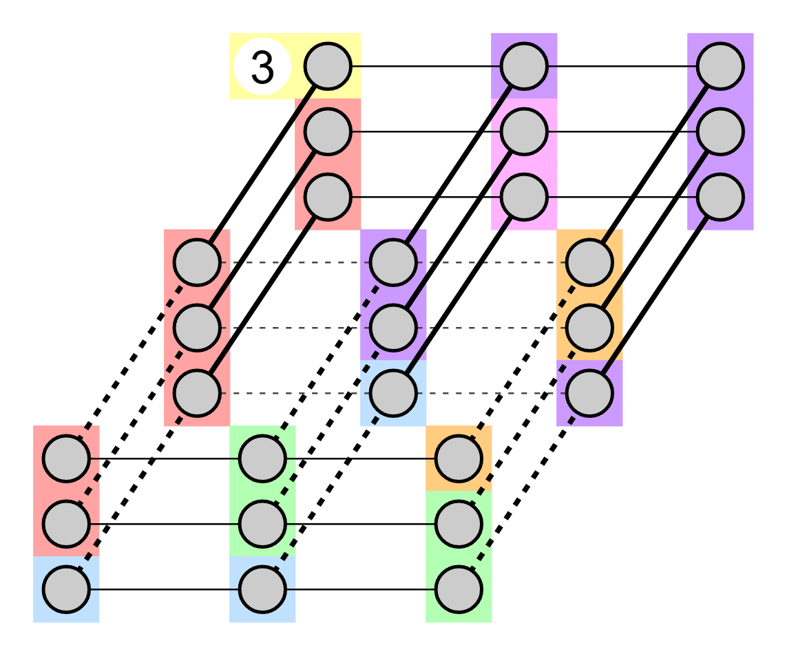
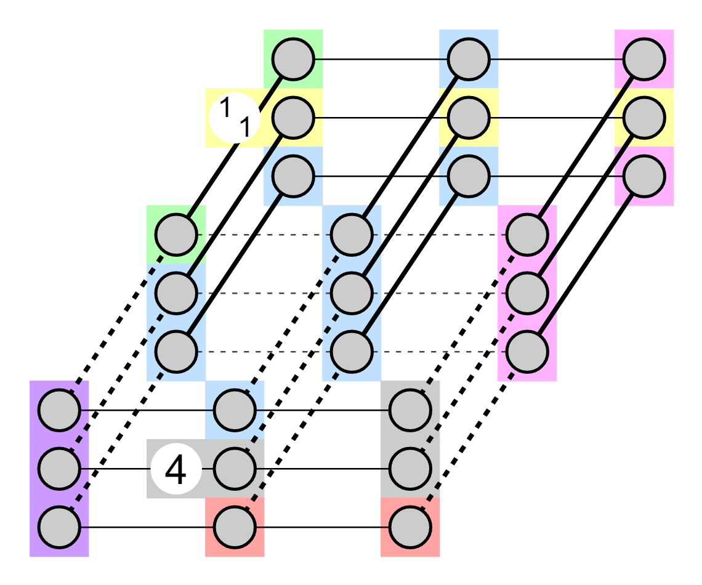
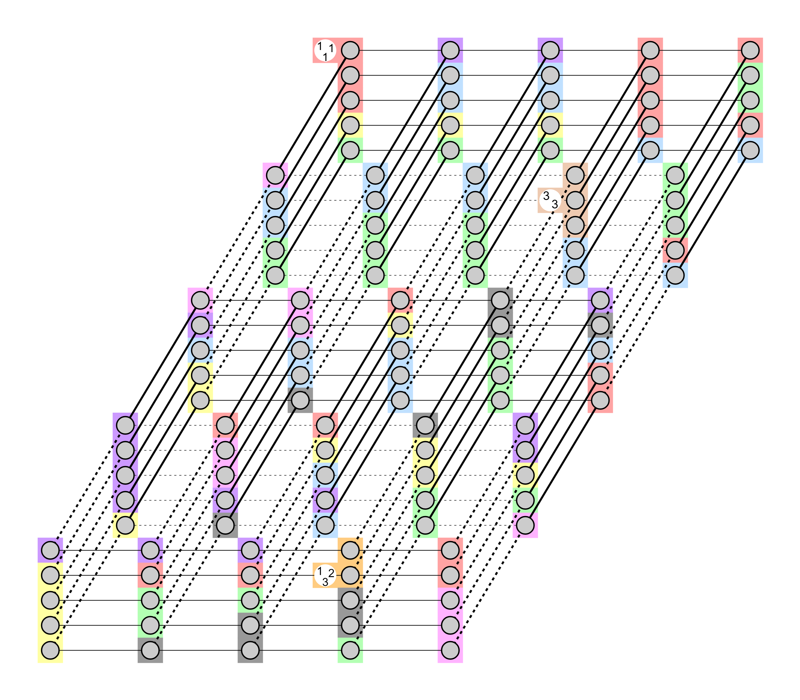

# Amorphous 3d Tapa

This is a [Tapa](https://puzz.link/rules.html?tapa) variant:  
Shade some blobs in 3d space. The grid is built of amorph blobs each containing one or more cells. A single blob must be either fully shaded or fully unshaded.  
Numbered blobs may not be shaded.  
We are going to differentiate "seeing" from "touching/contiguous".  
A cell sees the (up to) 26 cells around it that are at most 1 unit away in up to all 3 directions - that is, a cell can see the faces of a Rubik's Cube if it were the core.  
Two cells are touching/contiguous if they are separate by exactly one (given) line - that is, they are one apart in exactly one of their (x, y, z) coordinates and match in the other two.  
A number on a blob tells how many sets of shaded regions there are that are contiguous within the seen cells of that region.  
A 2x2x2 cube of cells may not be fully shaded.  
All shaded blobs must form one contiguous region - again, contiguous means "there is a path along the given lines only taking a single step at a time".  

Two example puzzles with their solutions (click to solve on Penpa+):
[](https://swaroopg92.github.io/penpa-edit/#m=solve&p=1Vbfb9s2EH73X0EQKJYUXGZZ/hHrLUvbvazt1mYoAiMoaJm2hUiiJ1F14qD92/vdUU6smAX2sD0MsiXy4x3vu+MdyfrvRldGRZGaqvhc9VWEZzgao9NX0wn9+u1zlbncJOKisNVmbZtaxK/Eld5o8fpOF5vciEhdNG5tq0QsNnqh1Me1XhhR28KIeW7ntchKES9EvdGpORNXayNWVbYQWS3mTZY7YZdC8+StuNHpWqS2dDors3IlbGmErQREjEhNntdn4kLUGIFt0hBFUzsxN8Jkbm0qsWzy/F7UxGJBir7flB45ezF4hd+7ppibCgLeZqHvRWl5lo7YJyMQJ7GyRMRZsciWS6iVLtPOCFkbgwEplpUthHS2Sdfo/0Lks1WDYMl2ngtmLiBfC5AUJ80G052Kwdi7BCu2KREUh2Ht2Cg+hYVnEbgD11twRChZU2jMFoNOZVKX2bIWP3vFrH4xuBTam0t1SSbZ4hLRrznW4kMzz25/qsVlA3ezJRndwikWSxHllvPV1j6Sw+Cxc6QLnXser81GVxSU+b0wdzp1iDmt3Mkq+2LKU5Fn6HRIPqqSGBKqwkDZ0QVbCGWVOLkjhXt67U7B0VaLrIQxUEPQCu2QMdAlByzngNvax8iXvNSYEK5zvjh2am230CyRKcZxYNqMqcyKA0rz+NV/XJED119ukWytSYS4bCPFjCHtJ3n5yGFwh0ekFHCIeNmDnDtM2b0OpYtn1KYoZfnSVgWH5oCKt4XY6hUqhmJ0MFgYDV+kdwYlp8VGuzXSx1JCUy3S8vDqgH0JFk7fUrLrfYnVzmwoF7VwWWEeE7qskTMiXZv0Ft/c2tua2IGsTm95WbbrDOmQZlWaY+6TrEzzBstGBd2uyd630zP1/s0btdR5bXqzduO56c1kLJUc8P/m2+7620z62T6/lWpw03vYfUgedp+T2c1XtfvrqXn+1PyYPMh4JJOJkvHYf6YywbYnhwP/HUUyGeMzlMkUn4lHxxAGOoYw0EkrO0EX6HnbPcfEUV/JKXQBT1vdqN/3eNT38lEEhRF9SYEkBgBoYABgQN/zViPGHDQwxBQ0MIz9d9TOMIICf6EwgH/vWv84VBgYSvI6Sh7wvqYx+DGDB4dx8zE4RikixyjFJ4DC5QAK9scoxTKABjlQpANoUJaWIYBSNI5QWqIAGuTL6xeCgyx4cUNwkAevfAj+gTSWOQBTlgRgSpoQjBwKwJRSITjMhBLuOYwce8M5pih1cHFAsijKAWqOx4oWk5pwWrEr3IkniilxZ4QRmpo6k6niikK+T4fKVxHlfn+Ke0o7AFuUDGjBFC0qWrDEa0PDmAJGaXiIO4wfJnUPDgdsgYZBggygOQEFmp6aEKUFimJPgeJMbaZA8aLOOTlDdEiIfCGeJAR+HD0WGnmPvTauV+Sxl8IIeRzFCN+AC/UKe5Xaxfx+xe8+v0f8/p1lXvP7E78v+T3k95hlJrTb9XqzGBQCD0z+n1Da+XGJ3BiJPV7WNv9cNxXdX2TCR4RizB8hHQin0IZOsg6YrUrcaYJDBJrFKiQ/xxXj2exb3Lk6gL9EdyBfHjJxVdMirso6Erqq7LaD4Pqy7gBz7XDlrtfZpgM7XDu79p3uMtS3+pm14snlrz15J/k/i3G+Tuj8nCa7C7X7zR8f+5NW7f7EAfo22X2k83MmJWQpDVkoitF+jXbEGwMykgSodenBqI/2O7SHOJDQvEazs5fs/khmuyslydCvrE1NWdgvYMpTcD+1xRy+zORBNPxI3SzsbdPKRrQLXXi+13u+UcsX4wd0qenpUitAl8j9x3SnN1/9OvT/4e1lf8bT9ru/GT09NygXOXl+5kN2995vzv/6HnPXVqStgkUJOFCXQIP11+JHJQj8qNjI4HG9Ad2XXBd9XnaAjisP4FHxAftB/dGsz0uQWD2vQjJ1VIhk6rAWZze97w==&a=VY07DkUhCET3Yk0hCH7Ktw7j/rfhjTkULyGZw2eGvY/8VdFaRX9FPlhiD9SYaDAxSwhWNoE2WHnmeAMicyJdgat1lJdOfijqKOG9o9wP7gf9pJ88WvjX859zAQ==)
[Solution to example 1](../../images/puzzles/2023/exampleAmorphous3dTapa1SOLUTION.png)  

[](https://swaroopg92.github.io/penpa-edit/#m=solve&p=1VZdb9u4En33ryAIFJsUvLmW5Y9Yb9m03ZdtuttmUQSGUdAybQuRRF+JqhMF7W/vmaGcWLYK7MPeh4VsiTyc4ZwZzpAs/1fpwqggUFMVXqq+CvAMR2N0+mo6oV+/eW4Tl5pIXGW22G5sVYpwKW71Vou3DzrbpkYM1FXlNraIxHKrl0p92uilEaXNjFikdlGKJCedcqtjcyFuN0asi2QpklIsqiR1wq6E5skbcaPjjYht7nSSJ/la2NwIWwiIGBGbNC0vxJUoMQLbpCGyqnRiYYRJ3MYUYlWl6aMoicWSFH2/yj1y8WrwBr+bKluYAgLeZqYfRW55lpbYZyMQJ7G2RMRZsUxWK6jlLtHOCFkagwEpVoXNhHS2ijfo/5fIJ+sKwZLNPFfMXEC+FCApzqotpjsXg7F3CVZslSMoDsPasVF8MgvPAnAHrnfgiFCyptCYLQSdwsQusXkp/uMVk/LV4Fpoby7WOZlkiytEv+RYi4/VIrn/pRTXFdxNVmR0B6dYLEaUG863O/tMDoOnzpEudB55vDRbXVBQFo/CPOjYIea0cmfr5KvJz0WaoNMi+axKYkioAgN5SxdsIZQU4uyBFB7pVZ+Doy2WSQ5joIagZdohY6BLDljOAbezz5HPeakxIVznfHHs1MbuoJkjU4zjwDQZU5g1B5Tm8av/vCIHrr/eIdkakwhx3kSKGUPaT/L6mcPgAY+IKeAQ8bIHOXeYsnsdShfPqElRyvKVLTIOzQEVbwux1WtUDMXoYDAzGr5I7wxKToutdhukj6WEplqk5eHVAfscLJy+p2TX+xIrndlSLmrhksw8J3ReImdEvDHxPb6ptfclsQNZHd/zsuw2CdIhToo4xdxnSR6nFZaNCrpZk71v5xfqw7t3aqXT0vRmzcYz781kKJUc8H/+vb77PpN+ti/vpRrMe0/1x+ip/hLN5t9U/ddL8/Kl+Sl6kuFYRgMlw6mMRkoOBzKaKjnqy2iCT+A/Q/+Z8GcMBUiOvcLEK0zQwyyX6AG8HDE4hR56U+jhE/QxKdCg7zWDwAsHgZcOBuhjy0UDAA0MLmUU4htiAh4gkgQMMRN/Q/8d7TVH0BzTF5pjOHgDB8mXGaxIRf7JeTPPDO0GgWAQPeF918RjBjqHsfThOUUpWqcoRa0DRTA6ULh2ilKIO9BODrQAHWinLC1PB4qgnaK0eB1oJ19e2i64kwUvfBfcyYPTogv+iTRWvgOmFOqAKZG6YORVB0xp1gV3M6EcPIaRY+84xxSlDi4TSBZFOUDN8VjRYlITTit2hTvhRDEl7owwQlNTZzJVtHgBKm86VLwK1EbccXdpBmCrKU6YokVFC5Z4bbjuFWUFDQ9xr/HDpO7B4YAt0DBIkAE0J6BA01MToly3KEOiwKVKJUkUuCzRuSRniA4JkS/Ek4TAj6PHQiPvsdfGlYs89lIYIY+DEOEbcKHeYv9SdcjvN/zu83vE799Z5i2/P/P7mt9Dfo9ZZkI7YK83C0Gh44HJfxNKpwEullsjse/L0qZfyqqgO42M+NhQjPljpQXhZNrS6dYCk3WOe07nEIFmue6SX+DacTT7DvewFuAv1i3Il4eMXFE1iCuSloQuCrtrIbjSbFrAQjtcw8tNsm3BDlfRtn2n2wz1vT6ylr24/K0nHyT/ZyHO3AmdqdOovlL1bzg+Dk5fVf+JQ/V9VN/QmTqTUoWchiwUUPstHUG8MSAjSYBa1x4M+mjfNAcSmndotvaS+o9oVt8qSYZ+ZW1qysx+BVOegvuxzRbwZSYPouFHympp76tGNqBd6MrzvdvzDRq+GD+gS01Pl1oddInc/5nudP7Nr0P/b99osLPVH/x5SV/a1eoPzW0gpF15f4l6eeaoIjk5vgpAlhWxZ//jW89DU6i26KxVwB3lCrSzLBv8pDKBn9QgGTwtQ6D7Smyjx9UI6LQgAZ7UJLCflCXNelyZxOq4OMnUSX2SqcMSnc17PwA=&a=VY5BDsUgCETv0jULQRFd9hyN979Gf8pj8ROTeTozwvMc+TuXtiZ2X/KDLfqBWoFjmRU4li2gB9ZovIwOeLW8/vGV0CfKyEHSNe8+0EidEyUf5GOnLjZeDNr099c/5wU=)
[Solution to example 2](../../images/puzzles/2023/exampleAmorphous3dTapa2SOLUTION.png)

Click the image to solve on Penpa+.
[](https://swaroopg92.github.io/penpa-edit/#m=solve&p=7VrdjttG0r2fpyAIBGsH/XnFvx/pzp+T7E3i7CZeBMZgEHA0nBExkjgrURlbhvPsOecUNZas2ovdzaUhid192FWsqq6uLnZr+69ds2lDloS0ClkdJiHhJ03KkEzKPBR5qt9k/LzphmU7i16u+s3Dot9to+wmetM8NOHlblj0m1l089DchPDzorlpo22/aqPrZX+9jbo1e24fmnn7InqzaKO7TXcTddvoetcth6i/jRqxHLu3zXwRzfv10HTrbn0X9es26jcRurTRvF0uty+il9EWd5b2gGi12w7RdRu13bBoN9Htbrl8H20pxQ0Jrb1bG/Liq/QbfF/vVtftBh3smavmfbTuxeWk2y9tBBNFdz0FGfropru9Bdl66JqhjeJt2+JGHN1u+lUUD/1uvkD7rxS+u9vBRPHI56Ukj9B/G0HI6NnuAeyeR2lpKuEp/W4Nowy43Qx6KIpVD80SyA68eYSMMKUoowbcMoizaedD16+30f8ZYbf9Kn0VNfa4ebPmI/XEW1h/K1tHP+2uu/u/bKNXO6jb3fKhj1BK3eaw8ijzm8f+STjcPFeOtKB5r/vb9qHZ0CjX76P2XTMfYHOO3LO77rd2/TxadmicCPlEym5wow1urE9oIS06dZvo2TsSvOdl/xwy9pubbo2HQTQYbdUM8BjQUoFePjA89k+WX2uowRCqy18GKbXoH0G5hqe0gwwzesymvZNBycdG/2lEjlT/+hHONj4SJl6PlpLE6G1Mvn6SIX2HTzSnwdHF+h753LHLHmjoLibR6KL08tt+s5JpjkSxZ8G2zR1mDG10dHPVNtAlNmUw5ZrooRkWcJ+eDs25yOHR6ED6NaQYmns6e3OYYtuhfaAvNtHQrdonh15v4TPRfNHO71Eu+/5+S+kgbDO/17A8Ljq4w7zbzJfg/axbz5c7DBsn9DgmB92evwg/fvdduG2W2/bicgw3VxeXcRaHONXv6vf9298vY+P26w9xSK8uPux/mn3Y/zq7vPoY9v/8VK0/VX+efYiTZBrPyhAn6WQs83iWJKzUYyVL7U5WWlkUYwnKAmWZjWVleJXEsxTldOQ4BUfen4IhynRi/NIJ+KFfmoJfxRL8WGbgp9L4pTn4sSzBj/1L8FMJfiwr8CPfCvxYTtGesrR2NgGdSmoGgmxihFmKB/BGhgeohCAqqTk7ZJBIlRwisSztUVlpomeViZRVB9bVyHoK1ijzidkin4C1SrNZnoAhdMppW+K0LcvcGOa52SzPzWY5dYZOOXVmSZ1JT51rlDXoOFj5lCKjUkzwBPQsJpAE1iwSSIKeRQJJWGb2hILKssxNtSI3SYrCrFaUNipFZaNcVGa0ojbNitq8oaR10a+kccG/TIxfmRi/cvSvkppSwJKqEqCqKkfCAoTqQD+yCh4BVcrKRClrc5CyhijsUNGTVEnAEz2rxJSrEvBEzyoFT5Z0JXXMwdIqo72qwoa4KmzkKlqWJLQsxKrqkWVtI1yNXlZTXzKoqbBVRmlqqpxMWDEVa7oReNa5eXZdmGfXBd2HHTm1rGKzsqY/kaI2P6lrs2bNuQWpas4tSDGlP6HfNDHpp6mN9pRzSyX4sR+NzH40MvHC/Gc6zq2p/Ayh4fUhNFyiSOJAH4yvxrmB0IPYc4AkPbqlTxjok9kHXN+SC61wiWcfR6cxzngw+Z/DnCceDPEdmGb0YOpzDjN+eTBM6cD0SgfmgHiwryVD4TmsyOjBrpaKmx7saqmo6sGuloq5Dkw38WBXSwVoB2bs8mBfS84zD3Z7K9Z7sCugFgIH5rrgwFwmPNgdBq0dDswQ4MBcWDzY15LLjgf7WjKGODCXqHNYK5YHu1pqPXNghiMH9mexFj8H5gLhwa6WWikd2HdNraMO7LumVlkH5tLgwFyCz2EtyB7sDoOWaw92h0GLuQe7Wmqp92BXSyUCDsy8wIGZJniwryWTCA92tVSK4cGulkpAPNjVUumJA/uuqdzFg30BfddUouPA/gKjJMiD3WFQiuTB7jAof3JgZlMe7GqpXMuBmXo5sL/AKC/zYFdL5Wwe7Gvpz2IleB7sa8n0z4H9VUrJoQP7rqnE0YF911RS6cD+AqOU04GZgXqwOwzKSh3YX2CUs3qwr6WfQCnBPYeV73qwq6WyYQ92tVSu7MD+LFYm7cGulsqzPdjREvnzd5Y/B+W5Nd4LkNkGZaBqTCdBuSEbyAaDsjY1StzRqyEaWAKDlio1ptNgr4BoYNkICu9qlLjDwMsGQm1QSGQDXhzkbWrkWZAfqFHhDkeIDYxJkO3UyOsgrSTONA3KtfSKzO1UOqkaJe7QfdSYVkGZAxvIFYLWdDYQhoO9F7JRJcFe/fgaNimDQowaeRI0+dWocIfTkg0aUZkk67ChUjzbowjKvWwfIhze22nAw7s53lRAa+9deIUIygNFm4P2sIcxDYd3fWTDoB37pzU0t3crvGeA1vYB8AIAvcf9jCwDreFImaH12B8WUOIqWhiNGSX7TGizcQ8kg8mYg9k+CGjH/jDYYZsD/mIGFy3wcY8C3mLmFm1p1qblIb/WPdbhLlqQ+KYPb9FKwTqcRSGc4wFfUWwVbR20OLLPJAOt6YVMJGg5Yb3KQGs41u6gAExayK8VVLQVaE0vbrJrzRFtBVrDscCD1nBkaKA1+ZE6wT9ML+Q0oB3xmt5hOLIA0I76wkXlXKItzLdsB8Rcy3Y5zLNsJ8Mci3aDZyvFhO/Ls23/hQ14ttIyNeDZSpjYoGcrlWGDnm1bCGxgpBS/2aBnK7KqgbFSzFMDyioaiSafBNt6EIMCDDgB2A0bCYrBxqAAg8MdaKy4ZQxyMOCWhRhMMbu5SSIGuMNobQymmN2HO3UOBgcaTHXb6mCjZnjgLoYYMDyMd2B6MDjcqRkeDjRFavHFGFQWX9QtxR3GF2NQWXxRA4ZXfGEDsxOjMBoE0zMo17ZRKDEK4x1M0KD81EYBHnMwPKZoUO5vDAowGE2FScpTngMD3GEmqwYMrxzTGGDOcw4YA8bY0VSYqWAw3sFURYwd72CugsGBBhPBNvHYQIxVkDYGtQVp0eCiIG0MMNnM8FgrUu24vMHObthnun6j60TXQtfv1edbXX/R9ZWuua6l+lTcG764uMRs1IHXf/nBOvWF+gv1F+ov1F+ov1D/L9Q868TfJh7aGKea8bZf/rrdbXhiH890KBqE2aHpCYRz1wee3Z6A3d0ap/juLYLtzZ3X/xqH6p9xf8S/DE4A+8fICWTvc/Fs2OxGZNh0Jz2azaZ/PEFwYL84Aa6bAX8t2S66hxN4wB8tTp8/NKcSNvfNZ09bfVL540X8LtbvMsOJcsUT4+ls/zLs/8YDnk9ny2H/DxwZ/zDbv+aJ8WWsV1akEuqUZKh/y+Mfg3956vDKwGSC+mvUc5wOofoW1fEt93vr+PfZ5f5NiPmg/xc1q/Gq/w2SioXa8351DV0u4yNr2J3t7qa/3419E742vzR53x7kTQ4Co8ORvKyavKx9Lu+o0JG89rL+58o7vfpoAzH5jw7s9z+OZ0us6MRHFR7mqMJclhW956rCl1ZW9FaryqGPcl1W9OJmlZGzXsH2P56dBx4dCB5O/45AO/7De5X2s6glBh7bA9oSOWpyr+aoqYPFT017Fpt2kGjbIX96ovtuDCn9xo0qgJ3AAtQNICN+FkOAn0ULPvA8YAA9xIxT9PO4Aeg8dAA8ix7A/k0AIdfPYwil+jyM8FFnkYSPOg4ml1cXfwA=&a=VZM9jqwrDET3MnEHgP/Dt45R738bgy6ngid1UOJrjl2F/fv7/fzv97PP+uz/fj5X+Oc80Qg7EomI4M8xiDSJ4j+1ORmRxyX6ibMgn5WcnODkDMJMAvLxjUjIJyGfFLmOhMijWsOJLa7b4rotrtsphOHCDMtmWDbHsiW1LEUukUvkEnkg+4LsC7IvyL6x7Df5d3KTf8Ihu0N2h+w3hHfrhvDEDQHBw3kvxFArFrVi0Vhs4o3NW4RRK4xa4TQWTmMRNBbJw0WRT5TIjeVoyHmTR9Bzbsi5IeedzPdJIeQN4Z3cEBC6HlhOjV+WahWWs2ksm4kqjV9tyLWxXBvLdWis7vgheLhyyBWQK7BcSr6UfLXILbImszV+rRBaIbTWs+96PnHH791yXHTwcK31bK1n3/F7n1rkFvmu5/t01/OfGI3fbFzMgTxaz9F6jpIfJT+B5dF6zpvM7/cP)