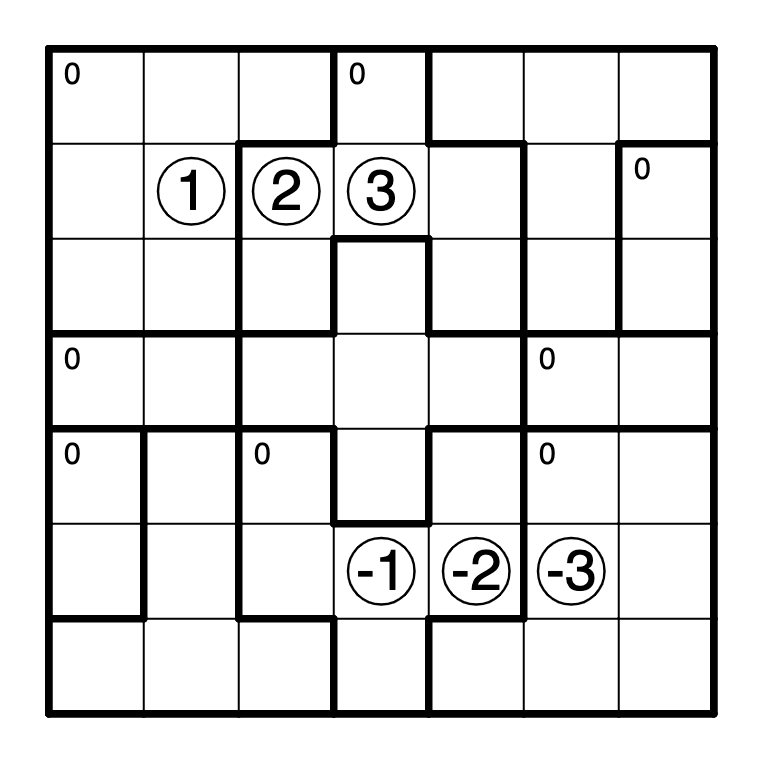

# Scoring Zones - Plus and Minus

This is a standard Scoring Zones puzzle, a puzzle type invented by [TheGreatEscaper](https://puzzling.stackexchange.com/users/32596/thegreatescaper).  

The grid has some numbered balls placed on the grid, and some numbered regions. Draw exactly one (possibly degenerate) path from each ball so that each cell in the grid is used exactly once. Each time a ball enters a region, the region's 'score' increases by exactly the amount marked on that ball - the goal is to ensure that the clued regions score the correct amount.

Click the image to solve on Penpa+.
[](https://swaroopg92.github.io/penpa-edit/#m=solve&p=tVXhb6PGE/3uv2LFp55EIjA2YL6ld0m/5NLr71KdrpYVrfHGpodZl4UmJcr97fdmWH6A7apq1Qp7/fbt7MzbwTNrfqtlqdwITxC7nuvjCbwZf0OPPt1zn1W5SsTHVJdZsRW/6EIZcSE+5LURstiI91lRG/eqrna6TMTmIDeue79TYltmG7GTRhi9V6Ko92tVqo1Yyzw34pDLFBNdiKxiL2OjUm0zXZhL8a6UT0I9y7TK/4C1Et8dtDHZGrON2qpClbJSb8RBVjvxWOq9UDLdcQx4FNVOVi2TKjBZAcYKy4yoDSL1vlN1Ka7JdpOZX3VWVK1Xo7Z7hQk2S6vrrAhRFxtVFor2SFbwhoI86RIEhTVIoBL6kSesEEeHhTRGpxk8bMRTBtuLVqSWMDCi0kIVpsZOPgwtpXndp8i6ZV6XpUqRzr2ui+rS/fHmxn2UuVGTpX2Xq8nS8R3XmeLrO6uvze1XJoLV5KX5X/LSPCTL1avb/NzDuIcfkxeMd8mLE4ROwht9+PGclesEETHw2zMxMcGAiafEXAy3xQFTw33xjKl+I2L6iDmPPVrwwMNqvmBndhbOOJidRf5wLQpGszlL72YhB+tmUb+GoJ+7g0JHmpVprh5uW0M+7ClLGk5YPvQpS+c+ZUnNEQshN5z3KY/3eBVuE/D4jkePxzmPt2xzDeF+tHD9BTI2RRIXnjv1/BYTT5kkHKPsF5ZfoAFQTpk/wnQGxlPwUM72AXxCL+FZ6Ppz5ITwPHL9EJkgHMbAC8sf4XmHoSeyeiLoiaweNKD/4xlsQmszw96Z3RsibmjjhoO4EWwiaxOBj1p+6g00R0fnojfCOAAe2ETWJoJNZG3oXNY/+/Rbe+QY/lt7/IK39gF0zqxOylWHA2ijf26nObaa4wX8dO9ugMOBnjnyE9r8EJ4Txsv/xH+BtzzOeAz5rxFRDU8my+mMW333zP/9GTWZ2wyt+k6Xe5k76C2O0fkDmtgjmr6TcE9ymWsb/ojKtT7k2D4is22BLtcvVWU9MFeb7TnztS7RkUcLT2i7I6K9BkdUW30jqiqz0VyWpX4aMXu0/RGxlhWuTbPLDmNPuErGAio5lii/yKNo+z4brxPn2eHvMkBDD6lvL5Lmym1+aBty19rd5ic07vdJc0d9e+lwg0F/YKMp4HUPP/E6obe2q3vAd7Z7A34GHHWq5kOybO5dh+J8z7sJOnv9O4S2Omie6v0aR1k6g2S0K6be6C91d4lQk7tq5d6ekRv0cgm2cgmdkUun+I/lLlav7Wvw/tal2V5j7b3yz5r6X1b3s600XZ4tNtBn6g3s2ZKz/EltgT+pIgp4Wkhgz9QS2ONyAnVaUSBPigrcn9QVeT0uLVJ1XF0U6qTAKNSwxparyTc=&a=RZHbCcRADAN7uW99XLx+1hLSfxuni5YEAhqwR4bNeV44P+awwPHBn9amgKUoYSUqWIsaNqLB+t7E8EMUcLmr4DJWw2WsQcjwxyDFpkTomj8uxZRBMbXH9TSRIZeokDKiEbpGyk1PCytKLitKLivKRYPWXn1RukbqTYaWQbFlUGy9Wr3uYEQUW9e4NHoXjkZ9jNGUMWpmjJoZo2bG7fJ/vd/1Aw==)