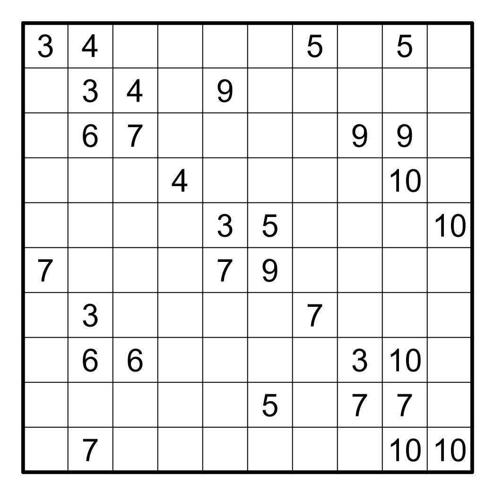

# Twilight Choco Banana

This is a [Choco Banana](https://puzz.link/rules.html?cbanana) puzzle with twilight clues - if a clue is unshaded, it must be part of a region that is neither a rectangle or square with a size equal to that number. If a clue is shaded, it must be part of a region that is either rectangular or square and that number indicates the size of at least one region that touches the numbered region orthogonally.

Click the image to solve on Penpa+.
[](https://swaroopg92.github.io/penpa-edit/#m=solve&p=1ZVvj6M2EMbf51O4lu4dWmEg2YQXrfb2bqtK2+2fbHU6oWjlgBPQAU6N6V6J9j77jcf0MJBKp0qtVBGcyY/x47FjPzS/t1wJj/nmE649+IYrYmu8g/UKb7+/Hgtdipg8Phdlccw1uc1lKslrXsPl3bQ6lyom2YlnnrfNeSZIIytBUlGWDZE10bkge8lVdvUqeAMfdkVuyFHJ9kTkgTSmR9ZnV22jyUGqinCiRKp5fSwFkYrYgnuBYCTQ1nOJWn6FTHhFfjhARt1We6FI0XyRehXckkKTos6KlGvR4BSaogONA8Z2cJ1zTeQfQpX81ECHmd5XqIFCKTiULOuRrJZtmmMu/FDiWMBCSgVLfZQ1L8s/+zn8tQ4pr0kqa80LSAMlmGsllehraUwJgGrzCPRA4Mr76e7OO/CyEYuk/6N3i4Qy6tEAbkZ3n7rtp4RSj+0W5+7X+Nw9xcnuxet+G8L1EG7jM7QP8ZmGPo0TGkJHlPFoyAyIHLAyYOmA9QREy4lGhF0cjQi7bAaw3BiwGsAK67h2AIo6XVYo6oBrzHBGWaMG8weymc5ug7Nzat+giNuH+dNSmB/NyLQ6xqaLwIKZTjCdNbPLPyIzHfsHjEqMrifTYBFKu4MtZ8MvsZdLVjixkbRd9wHBPmG4W95je4dtgO0jbCavC7F9g62P7RLbe8x5i+07bG+xjbBdYc612Y6LRRJaTxtfy/8fM4dy26oDTwUcywfrLfcUziRtZPnU9I9irVrhIbJnnsZ4uC0qpTyVRQ1pDiyONVjExUcGiux4KX8vVTZRfwY/GQFrsyOUFiotx0irYvSbKyWfR6TiOh+BPdfwKmry4jRWErUeF6D5uET+gU9Gq4Y5vyzoR4p3EoIPro3fbeLuxuu+N/t2cESv+wUM78e4ezB+Z73R7EpMCiB8O4Tv8LmJbi1kPsQPfQzhewjtqjzdW/JznHSPHjXjvMbeJqQVvGHw/PS/U1ntYSoJdRbDPmnaTH5o+1xmjtmNLXd7odxwKNeEtlwTXSjXzOJfLneze7F/g/9PXjam3tHLxjE7a+Hf9MbqDw79bW92iBhDJwvq71xo/dZ5H/TO2Sc5NukSa5MusaY4IljCF/IfWOLH3jGkGkzDOQ+ALxgH0IsG0fOZRwCfuYEZcG4IQC94AtCpLQCaOwPAmTkA+xt/MKpTizBVTV3CDDUzCjOU6xXJbvEZ&a=VYzLDcUgEMR64fwOgWX51ILSfxuJndOTIovMeuacUq+r/F5W2WXKBatJNakTNv2mH75DJ3T6xyH1Uye/t5sDPxiwo9y5qCaHbMBsvxhkg4nJYQagO1EWtcXKQtn8bho7yv07f9/9AA==)